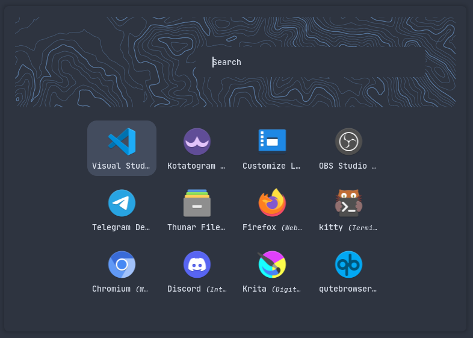
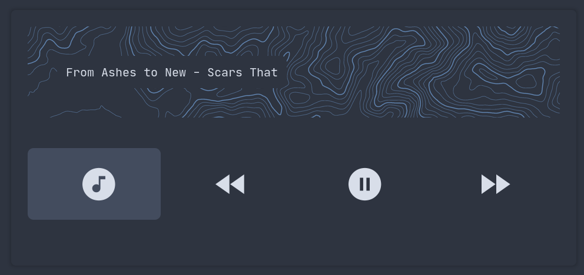
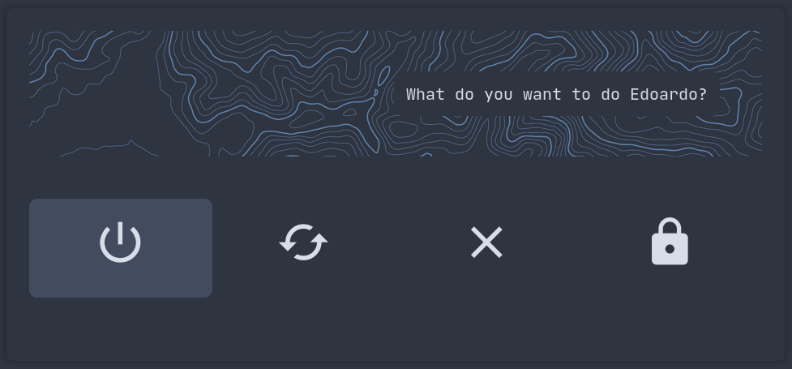
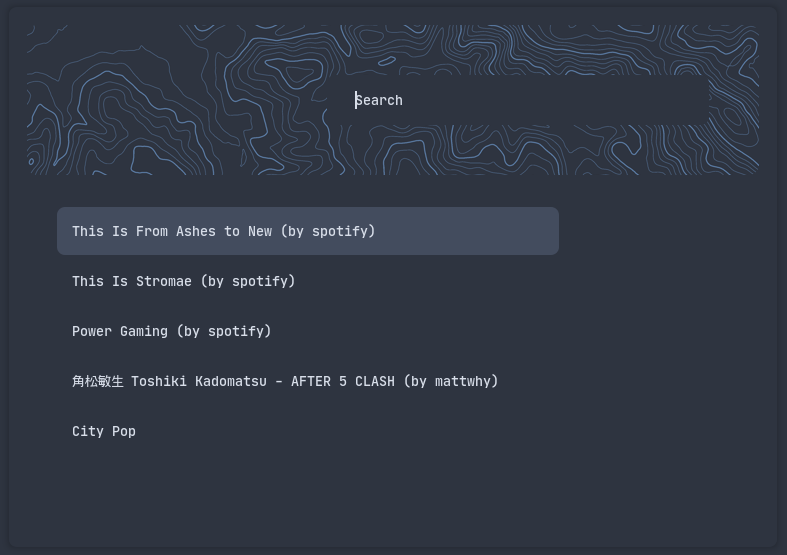

# Rofi Themes
This is a collection of themes

# Requirements

- rofi 1.7.2+ (CSS config style)
- any nerd font like `JetBrainsMonoMedium Nerd Font`

# Themes

## Application launcher
Used to launch program

### Usage
```rofi -show drun -theme applications -show-icons```

## Music Launcher
Used to:
  - open ncmpcpp
  - go to previous track
  - play/pause music
  - go to next track

### Usage
Use the script `musicontrol` inside the `scripts` folder


## Music Launcher
Used to:
  - poweroff
  - restart
  - logout
  - lock the screen

### Usage
Use the script `powermenu` inside the `scripts` folder


## Generic
Used for generic menu like playlist selection, todo, run, etc...

### Usage
```rofi -show run -theme generic```


# Screenshots
## Applications


## Music Control


## Powermenu


## Generic

